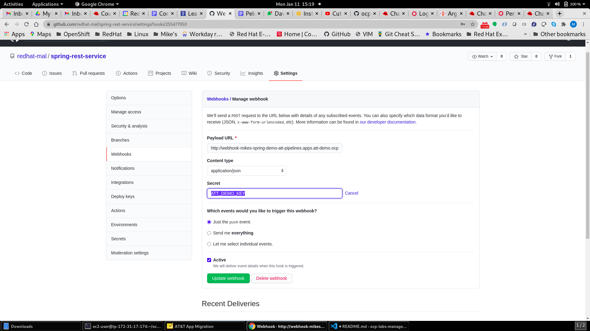

# ocp-labs-manager


## Setup an AWS instanct to install OCP and Pipeline Demo

### Configure an AWS Instance in the Desired Region and Create AWS Keys 

1. Launch a "Red Hat Enterprise Linux 8" instance with size of t2.medium or larger.  
- add tags to ensure it is retained: 
    Contact	<email address>
    AlwaysUp	True
    DeleteBy	Never
    Name	< worker instance >

2. Create a AWS Key for your User

Use the AWW console IAM service and navigate to your user account and use the "Security Credentials" tab to create access keys.  Save the keys for later use.

3. Create a SSH key for the instance

When launching the instance either use an existing ssh key set or create a new key and download the public key.


### Conifigure the AWS instance to allow installs

1. ssh to the instance 

```
 ~/.ssh/<your key>  ec2-user@<your instance public dns>
```

2. Setup AWS Credentials

```
cat > ~/.aws/credentials << EOF
[default]
aws_access_key_id = <your key ID>
aws_secret_access_key = <your key>
EOF
```

#### Configure Required tools

```
sudo subscription-manager register
sudo yum install git -y
sudo yum install wget -y
```

Install Helm3
```
sudo curl -L https://mirror.openshift.com/pub/openshift-v4/clients/helm/latest/helm-linux-amd64 -o /usr/local/bin/helm
sudo chmod +x /usr/local/bin/helm
helm version
```
Download and configure openshift installer with desired version
```
wget https://mirror.openshift.com/pub/openshift-v4/clients/ocp/latest-4.6/openshift-client-linux.tar.gz
wget https://mirror.openshift.com/pub/openshift-v4/clients/ocp/latest-4.6/openshift-install-linux.tar.gz
tar -xvf ./openshift-client-linux.tar.gz 
sudo mv oc /usr/local/bin
sudo mv kubectl /usr/local/bin
tar -xvf ./openshift-install-linux.tar.gz 
sudo mv openshift-install /usr/local/bin
```

### Install OCP Cluster 

Clone the labs manager repo

'''
git clone https://github.com/redhat-mal/ocp-labs-manager.git
'''


Modify install-config.yaml under the path ocp-labs-manager/config/ocp-demo-cluster/ocp-config.
- Modify the name of the cluster on line 29
- 

```
cd ocp-labs-manager/
./config/ocp-demo-cluster/install.sh ./config/ocp-demo-cluster/
```

### Run pipeline setup script to configure cluster auth and setup pipeline tools
```
 ./setup_pipelines.sh
 ```

### Configure Sample Spring App Pipeline

Fork the spirng app repo to your account: https://github.com/redhat-mal/spring-rest-service.git


```
git clone https://github.com/<your account>/spring-rest-service.git
cd spring-rest-service
git fetch

# Modify repo for staging deployment
git checkout stage
# Modify line 36 to point to your github repo  and commit and push
git commit -m "fix repo"
git push origin stage:stage

# Modify repo for qa deployment
git checkout qa
# Modify line 24 to point to your github repo  and commit and push
git commit -m "fix repo"
git push origin qa:qa


# Configure Argo Apps
 ./setup_pipelines.sh
 ```

### Configure Webhook in Github using tekton event handler

```
oc get route -n att-pipelines
```

Go to the github repo and select settings/webhooks
Create a new webhook with key of "ATT_DEMO_KEY" and the url of route.
Content type: application/json




### Modify app to initiate the build and deploy pipeline


```
# Deploy Argo App for Staging
git checkout main

# Modify any file 
git commit -m "some message"
git push

```


